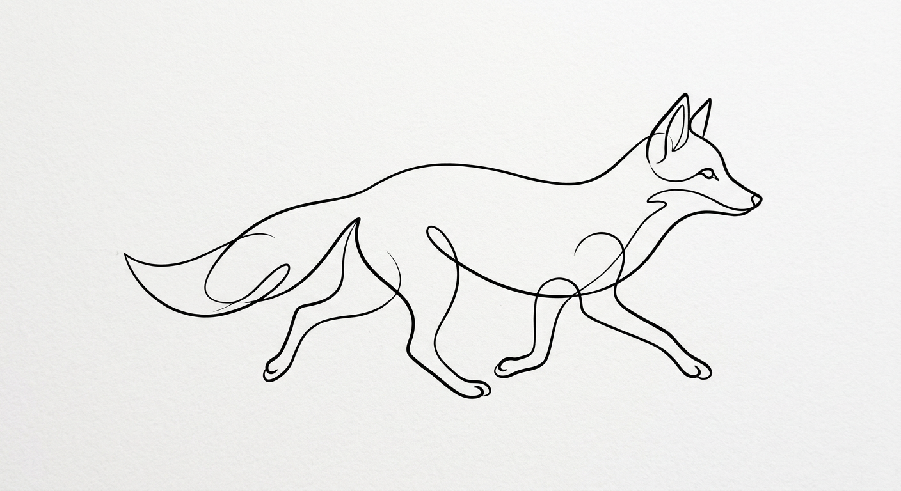

<p align="center">
  
</p>

<h1 align="center">nanaban</h1>

<p align="center">
  Image generation from the terminal. Two words and you have a picture.
</p>

<p align="center">
  <a href="https://github.com/199-biotechnologies/nanaban/stargazers"></a>
  &nbsp;
  <a href="https://x.com/longevityboris"></a>
</p>

<p align="center">
  <a href="https://www.npmjs.com/package/nanaban"></a>
  <a href="https://www.npmjs.com/package/nanaban"></a>
  <a href="https://github.com/199-biotechnologies/nanaban/blob/main/LICENSE"></a>
  <a href="https://nodejs.org"></a>
  <a href="https://ai.google.dev/gemini-api/docs/image-generation"></a>
</p>

<p align="center">
  Type a prompt. Get an image. Three seconds, one command, zero browser tabs. nanaban is a CLI for AI image generation that works for humans typing prompts and LLM agents calling <code>--json</code>. It runs on Google's Gemini image generation models and saves auto-named files straight to your working directory.
</p>

<p align="center">
  <a href="#install">Install</a> · <a href="#quick-start">Quick Start</a> · <a href="#how-it-works">How It Works</a> · <a href="#usage">Usage</a> · <a href="#models">Models</a> · <a href="#for-llm-agents-and-scripts">Agent Mode</a> · <a href="#contributing">Contributing</a>
</p>

---

## What It Looks Like

<table>
<tr>
<td align="center">
<br>
<code>nanaban "cyberpunk tokyo street neon rain" --ar wide</code>
</td>
<td align="center">
<br>
<code>nanaban "minimalist single line fox"</code>
</td>
<td align="center">
<br>
<code>nanaban "product photo white ceramic mug"</code>
</td>
</tr>
</table>

Every image on this page was generated with nanaban. ~3 seconds each, straight from the terminal.

## Why This Exists

Most AI image generators make you open a browser, wait in a queue, click through UI, and download manually. That workflow breaks the second you need images inside a script, a CI pipeline, or an agent loop.

nanaban fixes that:

- **One command** -- type your prompt, get a file. No browser, no signup flow, no queue.
- **Auto-names files** -- `"a fox in a snowy forest at dawn"` becomes `fox_snowy_forest_dawn.png`. No more `image_032_final_v2.png`.
- **Built for scripts** -- stdout is always the file path. `nanaban "a cat" | xargs open` just works.
- **Built for LLM agents** -- `--json` gives structured output. Plug it into any AI pipeline.
- **Tiny footprint** -- 6 dependencies. Ships TypeScript source directly, no build step.

## Install

```bash
npm install -g nanaban
```

Requires Node 18+. That is the only dependency.

From source:

```bash
git clone https://github.com/199-biotechnologies/nanaban.git
cd nanaban && npm install && npm link
```

## Quick Start

Get a free API key from [Google AI Studio](https://aistudio.google.com/apikey) (takes 30 seconds), then:

```bash
nanaban auth set AIzaSy...
nanaban "a fox in snow"
```

Done. The key persists across sessions. You can also set `GEMINI_API_KEY` or `GOOGLE_API_KEY` as environment variables.

## How It Works

1. You type a prompt.
2. nanaban sends it to the Gemini image generation API (Nano Banana 2 or Pro model).
3. The API returns raw image bytes.
4. nanaban auto-names the file from your prompt, saves it, and prints the path to stdout.

No temp files, no intermediate formats, no browser. The entire round trip takes about 3 seconds on the default model.

## Usage

```bash
nanaban "prompt"                          # auto-names, saves to CWD
nanaban "prompt" -o sunset.png            # pick your own filename
nanaban "prompt" --ar wide --size 2k      # 16:9, high resolution
nanaban "prompt" --pro                    # higher quality model
nanaban "prompt" --neg "blurry, text"     # negative prompt
nanaban "prompt" -r style.png            # match the style of another image
nanaban edit photo.png "add sunglasses"   # edit an existing image
```

### Flags

| Flag | What it does | Default |
|------|-------------|---------|
| `-o, --output <file>` | Output path | auto from prompt |
| `--ar <ratio>` | Aspect ratio (see table below) | `1:1` |
| `--size <size>` | Resolution: `1k` `2k` `4k` | `1k` |
| `--pro` | Use Pro model -- better detail, ~2x cost | off |
| `--neg <text>` | What to keep out of the image | |
| `-r, --ref <file>` | Reference image (style/content guidance) | |
| `--open` | Open in your default viewer after generating | off |
| `--json` | Structured JSON output for scripts | off |
| `--quiet` | Suppress non-essential output | off |

Every flag works with both `nanaban "prompt"` and `nanaban edit`.

### Aspect Ratios

14 aspect ratios, from square to extreme panoramic:

| Ratio | Shorthand | Good for |
|-------|-----------|----------|
| `1:1` | `square` | Profile pics, thumbnails |
| `4:3` | | Photos, slides |
| `3:2` | | Classic photo format |
| `5:4` | | Print, posters |
| `16:9` | `wide` | Hero images, banners, wallpapers |
| `21:9` | `ultrawide` | Cinematic, ultrawide monitors |
| `4:1` | `panoramic` | Panoramas, website headers |
| `8:1` | `banner` | Extreme banners, ribbons |
| `3:4` | | Portrait photos |
| `2:3` | `portrait` | Book covers, tall posters |
| `4:5` | | Instagram portrait |
| `9:16` | `tall` / `story` | Phone wallpapers, stories |
| `1:4` | | Tall strips, infographic panels |
| `1:8` | | Extreme vertical banners |

Note: `1:4`, `4:1`, `1:8`, `8:1` are only available on the NB2 (default) model. Pro supports the standard 10 ratios.

## Reference Images

Pass any image as a style or content reference with `-r`:

```bash
nanaban "portrait of a woman" -r painting_style.png
nanaban "modern living room" -r color_palette.jpg
nanaban "product shot" -r brand_reference.png
```

The model picks up on the visual language of your reference -- color palette, composition, texture, artistic style -- and applies it to your prompt. Useful for keeping a consistent look across a batch of images, matching brand aesthetics, or steering output toward a specific vibe without writing a 200-word prompt.

## Editing Existing Images

```bash
nanaban edit photo.png "remove the background"
nanaban edit headshot.png "make it a pencil sketch"
nanaban edit product.png "place on a marble table" --ar wide
```

Takes a source image and your edit instruction. Same flags apply -- change aspect ratio, resolution, or use Pro for finer edits.

## Models

| Model | Flag | Speed | Best for |
|-------|------|-------|----------|
| **NB2** (default) | -- | ~3s | Quick iterations, bulk generation, drafts |
| **Pro** | `--pro` | ~8s | Final assets, detail-heavy work, text in images |

Both run on Gemini's image generation models (`gemini-3.1-flash-image-preview` and `gemini-3-pro-image-preview`).

## For LLM Agents and Scripts

`--json` gives machine-readable output. No spinners, no colors, no ambiguity:

```bash
nanaban "a red circle" --json
```

```json
{
  "status": "success",
  "file": "/Users/you/red_circle.png",
  "model": "gemini-3.1-flash-image-preview",
  "dimensions": { "width": 1024, "height": 1024 },
  "size_bytes": 1247283,
  "duration_ms": 12400
}
```

Errors come back in the same shape:

```json
{
  "status": "error",
  "code": "AUTH_MISSING",
  "message": "No authentication found."
}
```

Error codes: `AUTH_MISSING`, `AUTH_INVALID`, `AUTH_EXPIRED`, `PROMPT_MISSING`, `IMAGE_NOT_FOUND`, `GENERATION_FAILED`, `RATE_LIMITED`, `NETWORK_ERROR`.

Exit codes: `0` success, `1` runtime error, `2` usage error.

### Piping

stdout is always just the file path. Metadata goes to stderr. These compose naturally:

```bash
nanaban "a cat" | xargs open                              # generate and open
nanaban "a cat" 2>/dev/null | pbcopy                       # copy path to clipboard
cat prompts.txt | while read p; do nanaban "$p"; done      # batch generate
```

## Auto-naming

Your prompt becomes the filename. Common words get stripped, capped at 6 words, joined with underscores:

```
"a fox in a snowy forest at dawn" -> fox_snowy_forest_dawn.png
```

Collisions auto-increment: `fox_snowy_forest.png`, `fox_snowy_forest_2.png`, `fox_snowy_forest_3.png`.

## Dependencies

Deliberately small:

- `@google/genai` + `google-auth-library` -- Gemini API access
- `commander` -- CLI parsing (~90KB)
- `nanospinner` -- terminal spinner (~3KB)
- `picocolors` -- terminal colors (~3KB)
- `tsx` + `typescript` -- runs TypeScript source directly, no build step

## Contributing

Contributions welcome. See [CONTRIBUTING.md](CONTRIBUTING.md) for guidelines.

## License

[MIT](LICENSE)

---

<p align="center">
  Built by <a href="https://github.com/longevityboris">Boris Djordjevic</a> at <a href="https://github.com/199-biotechnologies">199 Biotechnologies</a> | <a href="https://paperfoot.ai">Paperfoot AI</a>
</p>

<p align="center">
  <a href="https://github.com/199-biotechnologies/nanaban/stargazers"></a>
  &nbsp;
  <a href="https://x.com/longevityboris"></a>
</p>
